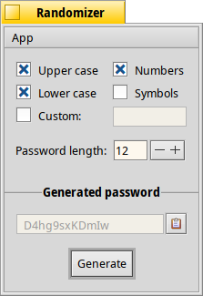

 Randomizer
==========

_Randomizer_ generates a random character sequence that can be used for passwords.   
Its GUI is very simple and intuitive:



The checkboxes limit the set of characters used for the password. If you activate just _Custom_, only the characters entered in its text field are used. _Password length_ lets you set an arbitrary length.   
Reasonably secure passwords should use upper and lower case, numbers and symbols (if allowed by the service you plan to use the password for) and should be at least 12 characters long.

Clicking the _Generate_ button (or hitting ```RETURN``` after launch) creates a new password. Clicking the clipboard icon (or pressing ```ALT```+```C```) copies the generated password into the clipboard.

As the settings are saved, once you tuned them to your needs, creating a new password is very quick: Launch _Randomizer_, hit ```RETURN``` a few times, press ```ALT```+```C```, then ```ALT```+```Q``` and you got your new password ready to use in the clipboard.
